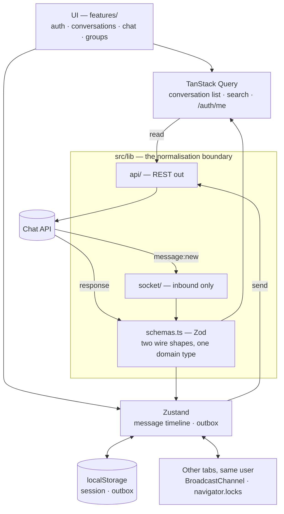
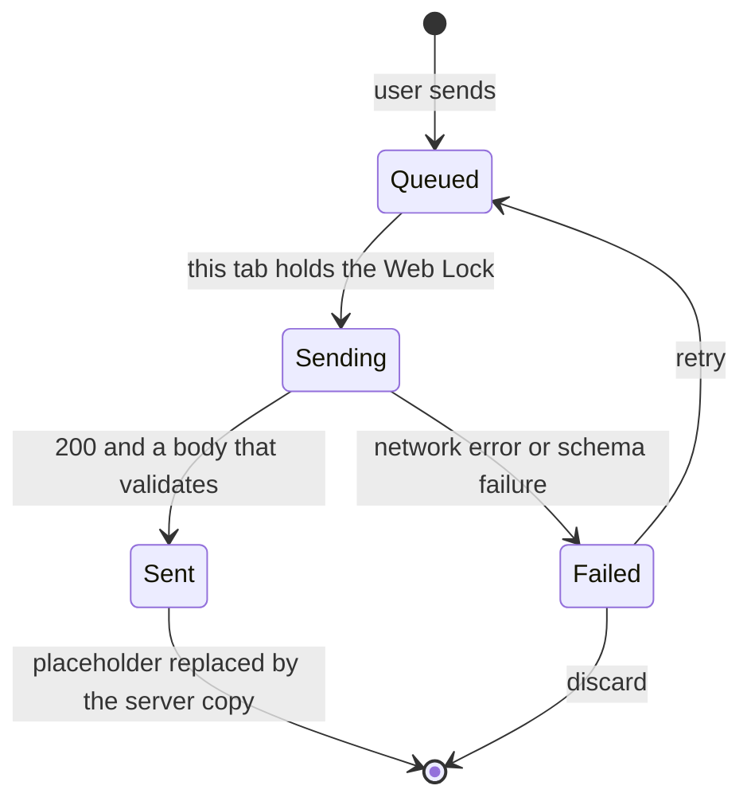

# Relay

A real-time chat app for one-to-one and group conversations, built against the Chat API
provided with the brief. Take-home submission for the Senior Frontend Engineer role at
Taghyeer Technologies.

You sign in with your phone number, find someone, and message them. Messages arrive
instantly, without refreshing. What makes it different is what happens when your connection
drops: anything you type is saved on your device first, shown as clearly waiting, and sent
in order the moment you're back. Nothing is lost, and nothing pretends to have been
delivered when it wasn't.

## Try it

| | Where |
|---|---|
| **Part 2 — landing page** | **https://taghyeer-chat-rust.vercel.app/** |
| **Part 1 — chat app** | **https://taghyeer-chat-rust.vercel.app/app** |
| **Part 3 — write-up** | [`docs/WRITEUP.md`](./docs/WRITEUP.md) |

There's nothing to set up and no credentials to ask me for. Sign in with any phone number
and a name — an unknown number just registers itself. The phone number is the entire
credential, with no password, because that's how the provided API works.

To see the offline behaviour without actually going offline, press **Cut the connection** on
the landing page, keep typing, then **Reconnect**.

> **The API falls asleep.** It's on a free hosting tier that shuts down after about fifteen
> minutes of no traffic, so the first request after a quiet spell can take up to a minute.
> The landing page quietly starts waking it while you read, and if a request is still slow
> you get an honest "waking the server up" message with a counter rather than a spinner that
> explains nothing.

## Running it yourself

```bash
npm install
npm run dev          # http://localhost:3000
```

Node 20 or newer. No API keys, no database, no backend to run locally.

```bash
npm run build        # production build
npm test             # 91 unit tests (vitest), ~0.4s, no network
npm run lint         # eslint — 0 problems
npx tsc --noEmit     # type check

# Re-check every claim in docs/API.md against the live API (~1 min, 57 checks).
# It registers throwaway accounts on timestamped numbers, so re-running is safe.
node docs/recon/verify-api.mjs
```

That last script is there so the documentation can't quietly drift out of date. If the API
changes, it will say so.

One note if you want to test two accounts at once: two tabs on the same address share their
storage, and therefore share a signed-in session, so they won't behave as two different
people. To get a genuinely separate second login, `next.config.ts` also allows
`127.0.0.1` during development — use `http://127.0.0.1:3000` for the second one. That
setting is development-only and doesn't affect what ships.

### Settings

Both are **optional** — the app falls back to these if you set nothing. See
[`.env.example`](./.env.example).

| Variable | Default | Note |
|---|---|---|
| `NEXT_PUBLIC_API_BASE_URL` | `https://frontend-task-chatapp.onrender.com/api` | Normal requests, **with** `/api` |
| `NEXT_PUBLIC_SOCKET_ORIGIN` | `https://frontend-task-chatapp.onrender.com` | The live connection, **without** `/api` |

## How it's put together

Two things shape the whole structure, and both come from testing the API before building
anything.

**Everything arriving from the network is checked and reshaped at a single point**, so no
part of the interface ever sees the raw format. The same message arrives in two different
shapes depending on whether it came through the live connection or an ordinary request, and
that difference is resolved once rather than in every component.

**Messages are sent as ordinary requests, not down the live connection.** The live
connection confirms a send but doesn't tell you what it saved, so there'd be nothing to
match against the temporary copy on screen. An ordinary request returns the saved message,
which is what makes that swap possible.



The outbox is the extra feature. A message is saved on your device before anything touches
the network, and only one browser tab is allowed to do the transmitting — because the API
has no protection against the same message being submitted twice, so two tabs draining the
same queue would deliver everything twice for real.



## Where things live

Organised by feature, with a hard boundary at `src/lib` where network shapes stop.

```
src/
  app/                 routes: / (landing), /login, /app, /app/c/[id]
  features/
    auth/              session store, login form
    conversations/     list, search, new-chat dialog
    chat/              message list, composer, thread, store, outbox, cross-tab sync
    groups/            members + admin panel
    landing/           interactive outbox demo, scroll reveal, API pre-warm
  lib/
    api/               client, typed endpoints, ApiError, warm-up
    socket/            socket provider (inbound only)
    cross-tab.ts       BroadcastChannel bus + Web Locks leader election
    domain.ts          the app's own vocabulary — no network types
    schemas.ts         Zod: two network shapes -> one internal type
  components/ui/       Button, Field, Avatar, Modal, Logo, states
```

**The rule:** nothing outside `lib/api` and `lib/schemas` ever sees an `_id`, a raw date
string, or a `{ data }` wrapper. One shape in, one shape out.

## What it's built with

**Next.js 16 (App Router) and TypeScript** in strict mode, with no `any` anywhere in the
application code · **Tailwind CSS v4**, with the colours declared once as roles rather than
fixed values · **TanStack Query** for state that's really a request · **Zustand** for the
message timeline and the outbox · **Zod** to check what comes back from the network, which
matters here because the API returns a success code with an empty body for a failed write,
so a failed check is a genuine signal rather than paranoia · **socket.io-client** ·
**Vitest**.

There are seven runtime dependencies and three of those are the framework, so four were
actually chosen. No component library, no form library, no state-machine library, no date
library. Three things that would usually be a dependency are browser features instead:

| Instead of | I used | For |
|---|---|---|
| a cross-tab state library | `BroadcastChannel` | keeping tabs of the same person in step |
| a distributed-lock helper | `navigator.locks` | picking the one tab allowed to transmit. The browser releases it automatically if that tab closes or crashes, so there's no heartbeat to maintain and no timeout to tune |
| a virtualisation library | plain DOM | not needed at this message volume, and noted as a limitation in the write-up rather than hidden |

The reasoning behind each of these, and what I turned down, is in
[`docs/WRITEUP.md`](./docs/WRITEUP.md) and [`docs/DECISIONS.md`](./docs/DECISIONS.md).

## The documents

All written to be readable whether or not you write code for a living.

| Document | What it is |
|---|---|
| [`docs/WRITEUP.md`](./docs/WRITEUP.md) | **Part 3.** How I built it and why, the design reasoning, how I used AI, and what I'd do with more time. Opens with a 60-second summary |
| [`docs/API.md`](./docs/API.md) | **Deliverable 1.** What the API actually does, as opposed to what its documentation says, plus how I'd redesign it |
| [`docs/openapi.yaml`](./docs/openapi.yaml) | The same thing, machine-readable |
| [`docs/api-findings.md`](./docs/api-findings.md) | Every fault I found while probing the live API, with the evidence for each |
| [`docs/recon/verify-api.mjs`](./docs/recon/verify-api.mjs) | A re-runnable script that checks all 57 documented claims against the live API |
| [`docs/DECISIONS.md`](./docs/DECISIONS.md) | Every non-obvious choice: what I decided, what I rejected, and why |
| [`docs/ai-usage-log.md`](./docs/ai-usage-log.md) | A log of how AI was used, kept as I went rather than tidied up afterwards |

## Licence

Copyright (c) 2026 Arnob Rizwan Ahmad. All rights reserved. This is a work sample submitted
as part of a job application, not an open-source project — see [LICENSE](LICENSE) for the
evaluation-only terms and [NOTICE](NOTICE) for authorship. The exact build is recorded on
`<html data-build>`.
