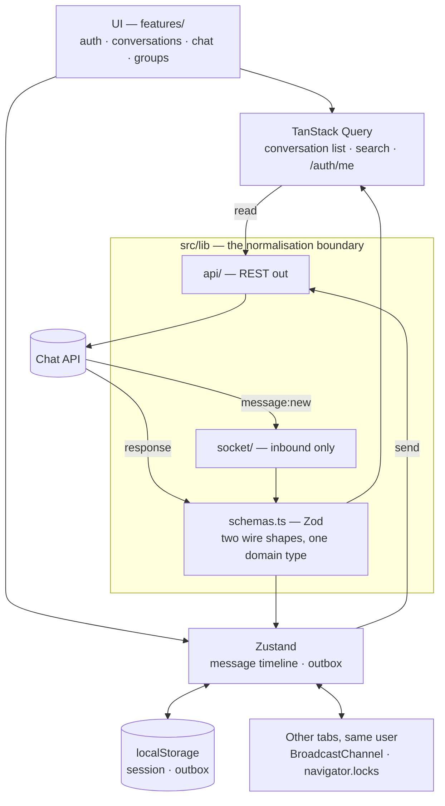
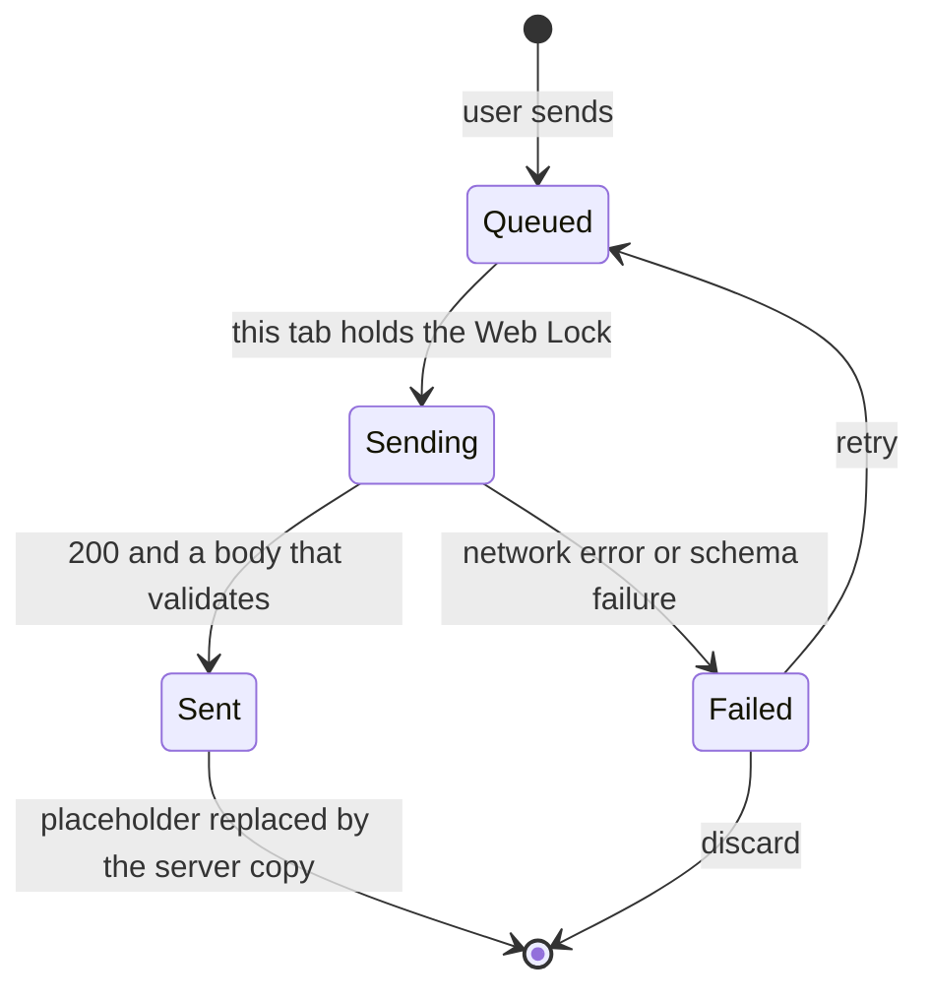

# Relay

A real-time chat client for direct and group conversations, built against the provided Chat
API. Take-home submission for the Senior Frontend Engineer role at Taghyeer
Technologies.

## Live

| | URL |
|---|---|
| **Part 2 — landing page** | **https://taghyeer-chat-rust.vercel.app/** |
| **Part 1 — chat app** | **https://taghyeer-chat-rust.vercel.app/app** |
| **Part 3 — write-up** | [`docs/WRITEUP.md`](./docs/WRITEUP.md) |

No credentials needed. Sign in with any phone number and a display name — an unknown number
registers automatically. The phone number is the whole credential; that is how the provided
API works.

> **The API sleeps.** Render's free tier spins down after ~15 minutes idle, so the first
> request after a quiet period can take up to a minute. The landing page starts waking the
> server while you read it, and a slow request shows a "waking the server up" banner with a
> live counter rather than an unexplained spinner.

### Worth trying, in about three minutes

1. **Real-time.** Open `/app` in two browsers, sign in as two numbers, and find the other by
   **name** — not phone. The search endpoint cannot match a `+`-prefixed number at all
   ([why](./docs/WRITEUP.md#issues-with-the-given-api)).
2. **The offline outbox.** On the landing page hit **Cut the connection**, keep typing, then
   **Reconnect**. Messages queue and flush in order. The real app does the same on airplane mode.
3. **Scroll behaviour.** Scroll up in a long thread while the other window sends. You are not
   yanked down; a "new messages" pill appears instead.
4. **Two tabs, one account.** Open `/app` twice in the *same* browser and send from one. The
   other updates instantly — which the API alone does not allow, because it sends the author
   no echo of their own message.

## Running locally

```bash
npm install
npm run dev          # http://localhost:3000
```

Node 20+. No API keys, no database, no local backend.

```bash
npm run build        # production build
npm test             # 91 unit tests (vitest), ~0.4s, no network
npm run lint         # eslint — 0 problems
npx tsc --noEmit     # type check

# Re-verify every claim in docs/API.md against the live API (~1 min, 57 checks).
# Registers throwaway accounts on timestamped numbers, so it is safe to re-run.
node docs/recon/verify-api.mjs
```

Same-origin tabs share `localStorage` and therefore the session. To run a genuinely separate
second login, `next.config.ts` allows `127.0.0.1` as a dev origin — use
`http://127.0.0.1:3000`. That setting is dev-only.

### Environment variables

Both **optional** — the app falls back to these if unset. See [`.env.example`](./.env.example).

| Variable | Default | Notes |
|---|---|---|
| `NEXT_PUBLIC_API_BASE_URL` | `https://frontend-task-chatapp.onrender.com/api` | REST base, **with** `/api` |
| `NEXT_PUBLIC_SOCKET_ORIGIN` | `https://frontend-task-chatapp.onrender.com` | Socket.io origin, **without** `/api` |

## Architecture

Everything crossing the network is normalised at one boundary, so no component ever sees a
wire shape. Sends go over REST rather than the socket, because the socket ack carries no body
to reconcile against.



The outbox is the original feature: a message is durable before it is ever transmitted, and a
single elected tab does the transmitting, because `POST /messages` is not idempotent.



## Project structure

Organised by feature, with a hard normalisation boundary at `src/lib`.

```
src/
  app/                 routes: / (landing), /login, /app, /app/c/[id]
  features/
    auth/              session store, login form
    conversations/     list, search, new-chat dialog
    chat/              message list, composer, thread, store, outbox, cross-tab sync
    groups/            members + admin panel
    landing/           interactive outbox demo, scroll reveal, API pre-warm
  lib/
    api/               client, typed endpoints, ApiError, warm-up
    socket/            socket provider (inbound only)
    cross-tab.ts       BroadcastChannel bus + Web Locks leader election
    domain.ts          the app's vocabulary — no wire types
    schemas.ts         Zod: two wire shapes -> one domain type
  components/ui/       Button, Field, Avatar, Modal, Logo, states
```

**The rule:** nothing outside `lib/api` and `lib/schemas` ever sees `_id`, an ISO date string,
or a `{ data }` wrapper. One shape in, one shape out.

## Tech stack

**Next.js 16 (App Router) + TypeScript** (strict, `noUncheckedIndexedAccess`, no `any` in
application code) · **Tailwind CSS v4** (tokens declared once in `@theme`) · **TanStack Query**
(request-shaped server state) · **Zustand** (message timeline and outbox) · **Zod** (runtime
validation at the boundary — the API returns `200` with a `null` body for a failed write, so
schema failure is a real signal) · **socket.io-client** · **Vitest**.

Seven runtime dependencies, three of which are the framework itself, so four chosen libraries.
No component library, no form library, no state-machine library, no date library. Three things
that would usually be dependencies are platform APIs instead:

| Instead of | Used | For |
|---|---|---|
| a cross-tab state library | `BroadcastChannel` | mirroring sends between tabs of one user |
| a distributed-lock helper | `navigator.locks` | electing the single tab allowed to transmit the outbox; the browser releases the lock on close or crash, so there is no heartbeat to maintain |
| a virtualisation library | plain DOM | not needed at this message volume; noted as a limitation in the write-up |

Reasoning for each of these, and the trade-offs rejected, is in
[`docs/WRITEUP.md`](./docs/WRITEUP.md).

## Documentation

| Document | What it is |
|---|---|
| [`docs/WRITEUP.md`](./docs/WRITEUP.md) | **Part 3.** Approach, design reasoning, AI usage, API issues, what I'd improve. Opens with a 60-second summary |
| [`docs/API.md`](./docs/API.md) | **Deliverable 1.** Full reference for the API as it actually behaves, plus a "how I'd redesign this" section |
| [`docs/openapi.yaml`](./docs/openapi.yaml) | Machine-readable version of the same |
| [`docs/api-findings.md`](./docs/api-findings.md) | Everything found probing the live API, with evidence |
| [`docs/recon/verify-api.mjs`](./docs/recon/verify-api.mjs) | Re-runnable harness asserting every documented claim against the live API (57/57) |
| [`docs/DECISIONS.md`](./docs/DECISIONS.md) | Every non-obvious decision: what I chose, what I rejected, why |
| [`docs/ai-usage-log.md`](./docs/ai-usage-log.md) | Running log of AI use, kept as I went |

## Licence

Copyright (c) 2026 Arnob Rizwan Ahmad. All rights reserved. A candidacy work sample, not an
open-source project: see [LICENSE](LICENSE) for the evaluation-only terms and [NOTICE](NOTICE)
for authorship. The exact build is on `<html data-build>`.
